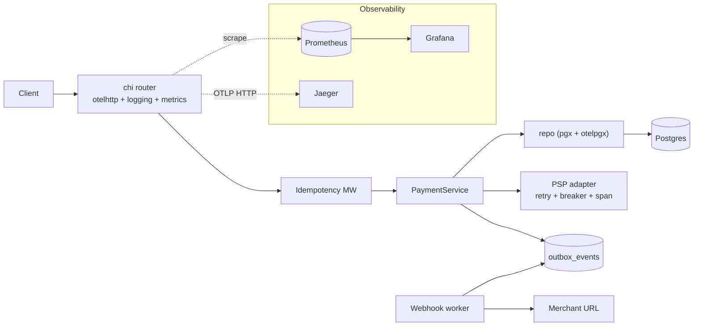

# PayFlowMock

PayFlowMock is a small **payment orchestrator**: an HTTP API that routes mock PSP charges and refunds with retries and circuit breaking, persists lifecycle state in PostgreSQL, deduplicates mutating requests with Redis-backed idempotency, and drains merchant webhooks from an outbox worker. It exists to exercise integrations and observability patterns—logging, Prometheus metrics, and OpenTelemetry traces—without calling real PSPs.

## Architecture



## Quickstart (full stack)

Prerequisites: **Docker** with Compose, **Go 1.25+** (for local `make run` without the app container).

1. Copy environment defaults and adjust passwords if you like:

   ```bash
   cp .env.example .env
   ```

2. Bring up Postgres, Redis, the API (`app`), Jaeger, Prometheus, and Grafana:

   ```bash
   make stack-up
   ```

   Compose builds the app image and overrides `DATABASE_URL` / `REDIS_ADDR` for in-network services; ensure `POSTGRES_*` in `.env` stays aligned if you also connect from the host.

3. Exercise the API on **http://127.0.0.1:8080** (or whatever you set in `PORT`). Example flows appear under [HTTP API](#http-api).

4. Open the observability UIs (defaults):

   | Tool       | URL                         | Notes                                      |
   | ---------- | --------------------------- | ------------------------------------------ |
   | Jaeger     | http://127.0.0.1:16686      | Search traces for service `payflow`        |
   | Prometheus | http://127.0.0.1:9090       | Targets → `payflow` job scraping `:8080`   |
   | Grafana    | http://127.0.0.1:3000       | Login `admin` / `admin` unless overridden  |

   Import path: dashboard **PayFlow** is provisioned from `deploy/grafana/dashboards/payflow.json`.

5. Tail logs:

   ```bash
   make logs
   # or scoped:
   SERVICES=app make logs
   ```

6. Tear down:

   ```bash
   make stack-down
   ```

**Minimal dev without the observability containers:** `make up` starts only Postgres and Redis; then `make run` starts the API on the host (loads `.env` via [godotenv](https://github.com/joho/godotenv)). Point `OTEL_EXPORTER_OTLP_ENDPOINT` at a local collector if you want traces.

## Requirements

- **Go** 1.25+ (`go.mod`)
- **Docker** — for Compose (database, cache, full stack)

## Configuration

| Variable                       | Description                                                                                   |
| ------------------------------ | --------------------------------------------------------------------------------------------- |
| `DATABASE_URL`                 | PostgreSQL DSN (**required**). Compose overrides this inside the `app` container.             |
| `REDIS_ADDR`                   | Redis `host:port` (default `127.0.0.1:6379` when unset).                                     |
| `POSTGRES_*`                   | Used by Compose for the `postgres` service; host-side DSNs must match.                        |
| `API_KEY`                      | If set, `/v1/*` requires `X-API-Key` or `Authorization: Bearer <token>`.                     |
| `PORT`                         | HTTP listen port (default `8080`).                                                          |
| `MIGRATIONS_PATH`              | Directory of SQL migrations (default `./migrations` relative to cwd).                       |
| `OTEL_EXPORTER_OTLP_ENDPOINT` | OTLP HTTP endpoint for traces (Compose default `http://jaeger:4318`).                       |
| `OTEL_SERVICE_NAME`            | OpenTelemetry `service.name` (default `payflow`).                                           |
| `OTEL_TRACES_SAMPLER_ARG`      | Root sampling ratio `[0,1]` (default `1.0` — sample everything in dev).                     |
| `LOG_LEVEL`                    | Zerolog level: `trace` … `disabled` (default `info`).                                         |
| Webhooks                       | See `.env.example`: `MERCHANT_WEBHOOK_URLS`, `DEFAULT_WEBHOOK_URL`, `WEBHOOK_POLL_INTERVAL`, etc. |

See `.env.example` for integration-test URLs and idempotency tuning (`IDEMPOTENCY_REQUEST_TIMEOUT`, `TEST_DATABASE_URL`).

## Makefile targets

Run `make help` for the full list. Highlights:

| Target            | Purpose                                                          |
| ----------------- | ---------------------------------------------------------------- |
| `stack-up`        | Full stack: build + start all Compose services (needs `.env`).    |
| `stack-down`      | Stop and remove Compose services.                                |
| `logs`            | Follow Compose logs (`SERVICES=` optional).                      |
| `docker-build`    | Build only the `app` image.                                      |
| `up` / `down`     | Postgres + Redis only.                                             |
| `run`             | Run `./cmd/server` with `.env`.                                   |
| `test` / `test-*` | Unit and integration test splits (see `make help`).              |

## HTTP API

Base path: `/v1`. Errors are JSON: `{ "error": { "code": "...", "message": "..." } }`.

| Method | Path                         | Description                          |
| ------ | ---------------------------- | ------------------------------------ |
| `POST` | `/v1/payments`               | Create a payment                     |
| `GET`  | `/v1/payments/{id}`          | Get payment by ID                    |
| `POST` | `/v1/payments/{id}/refund`   | Refund a payment                     |
| `GET`  | `/healthz`                   | Liveness; pings Postgres             |
| `GET`  | `/metrics`                   | Prometheus scrape endpoint           |

**Routing (mock PSPs):** INR → `razorpay_mock`; USD / EUR / GBP → `stripe_mock`. Amounts above `100000` smallest units route to Stripe for other currencies.

**Idempotency:** For mutating methods, send `Idempotency-Key` or `X-Idempotency-Key` to enable Redis/Postgres-backed deduplication and replay of identical requests.

### curl examples

Replace UUIDs and IDs with real values from responses. If `API_KEY` is set, add `-H "X-API-Key: $API_KEY"`.

Create payment (USD → Stripe mock):

```bash
curl -sS -X POST http://127.0.0.1:8080/v1/payments \
  -H 'Content-Type: application/json' \
  -H 'Idempotency-Key: demo-create-1' \
  -d '{
    "merchant_id": "550e8400-e29b-41d4-a716-446655440000",
    "amount": 100,
    "currency": "USD",
    "idempotency_key": "pay-key-1"
  }'
```

Fetch payment:

```bash
curl -sS http://127.0.0.1:8080/v1/payments/<payment-id>
```

Refund:

```bash
curl -sS -X POST http://127.0.0.1:8080/v1/payments/<payment-id>/refund \
  -H 'Content-Type: application/json' \
  -H 'Idempotency-Key: demo-refund-1' \
  -d '{
    "amount": 100,
    "currency": "USD",
    "idempotency_key": "refund-key-1"
  }'
```

Force a **4xx** (invalid JSON):

```bash
curl -sS -o /dev/null -w "%{http_code}\n" -X POST http://127.0.0.1:8080/v1/payments \
  -H 'Content-Type: application/json' \
  -d 'not-json'
```

`amount` must be a JSON **number** (not a string) so it unmarshals into `big.Int`.

## Observability

The server exposes **structured JSON logs** (zerolog), **Prometheus metrics** at `/metrics`, and **OTel traces** exported over OTLP HTTP (BatchSpanProcessor). Request middleware records HTTP RED-style signals; the payment service and PSP adapters emit domain spans (`payment.create`, `psp.charge`, etc.); pgx and Redis calls are instrumented.

### Metrics (application)

| Metric | Type | Labels / notes |
| ------ | ---- | ---------------- |
| `payflow_http_requests_total` | Counter | `route`, `method`, `status` |
| `payflow_http_request_duration_seconds` | Histogram | `route`, `method` |
| `payflow_payments_total` | Counter | `status` (`success`, `failed`, `refunded`, …) |
| `payflow_payment_latency_seconds` | Histogram | `psp` |
| `payflow_psp_attempts_total` | Counter | `psp`, `op` (`charge` / `refund`), `outcome` |
| `payflow_psp_retry_attempts_total` | Counter | `outcome` |
| `payflow_psp_circuit_state` | Gauge | `psp`; `0` closed, `1` half-open, `2` open |
| `payflow_webhook_delivery_attempts_total` | Counter | `outcome` |
| `payflow_webhook_delivery_latency_seconds` | Histogram | _(no labels)_ |
| `payflow_outbox_pending` | Gauge | Pending outbox rows |
| `payflow_idempotency_cache_total` | Counter | `result` |

The registry also exposes Go runtime and process collectors (`go_*`, `process_*`).

### PromQL examples

**HTTP P95 latency by route** (histogram `_bucket` suffix):

```promql
histogram_quantile(
  0.95,
  sum by (le, route) (
    rate(payflow_http_request_duration_seconds_bucket[5m])
  )
)
```

**Retryable PSP errors per minute:**

```promql
sum by (psp) (
  rate(payflow_psp_attempts_total{outcome="retryable_error"}[1m])
)
```

**Webhook delivery P95:**

```promql
histogram_quantile(
  0.95,
  sum(rate(payflow_webhook_delivery_latency_seconds_bucket[5m])) by (le)
)
```

**Approximate PSP attempt success ratio** (adjust outcomes to match your label values):

```promql
sum(rate(payflow_psp_attempts_total{outcome="success"}[5m])) by (psp)
/
sum(rate(payflow_psp_attempts_total[5m])) by (psp)
```

### Jaeger

1. Open http://127.0.0.1:16686 .
2. Choose service **`payflow`** (from `OTEL_SERVICE_NAME`).
3. Search by operation (e.g. `payment.create`, `psp.charge`, `webhook.deliver`) or inspect recent traces.

You should see a waterfall linking HTTP handling to service and PSP spans; DB spans appear under otelpgx.

**Correlating logs:** structured logs include `trace_id` / `span_id` when the request carries an active span—match `trace_id` to Jaeger’s Trace ID.

**Screenshot placeholders (optional):**

> **Figure — Jaeger:** Trace covering `POST /v1/payments` → `payment.create` → `psp.charge` → SQL spans.  
> **Figure — Grafana:** `deploy/grafana/dashboards/payflow.json` overview while load-testing.

---

## Runbook

| Symptom | What to check | Mitigations |
| ------- | ------------- | ----------- |
| Elevated PSP failures | `payflow_psp_attempts_total` by `outcome`; traces for `psp.charge` / `psp.refund` | Inspect mock latency/failure config in code; confirm routing selects expected `psp`. |
| Circuit appears open | `payflow_psp_circuit_state == 2` | Stop hammering failing PSP; wait for half-open / reset; fix upstream error rate. |
| Outbox / webhooks lagging | `payflow_outbox_pending` rising; webhook histogram tail | Verify `DEFAULT_WEBHOOK_URL` / merchant URLs reachable; check worker logs; reduce poll interval only after fixing sink slowness. |
| Idempotency conflicts | `payflow_idempotency_cache_total`; HTTP 409 | Same key reused with different body; align clients or use fresh keys. |
| No traces in Jaeger | App env `OTEL_EXPORTER_OTLP_ENDPOINT`; Jaeger `4318` reachable | From host-run app, use `http://127.0.0.1:4318`; inside Compose use `http://jaeger:4318`. |
| Empty Grafana panels | Prometheus targets UP; time range | **Explore → Prometheus** with sample PromQL above; confirm dashboard datasource provisioning. |

---

## Trade-offs

1. **Transactional outbox + polling worker vs Kafka (or similar):** Polling is simple and dependency-light for a demo; production systems often publish outbox rows to a bus for horizontal scale, lower latency, and clearer back-pressure semantics—at the cost of operating another cluster.

2. **Batch OTLP export vs synchronous export:** The tracer uses a batch processor for efficiency and lower request overhead. That improves performance but means a crash immediately after a response can lose spans still in memory—mitigated with graceful shutdown (`Shutdown` on SIGTERM) and acceptable sampling trade-offs.

3. **Sampling:** `OTEL_TRACES_SAMPLER_ARG=1.0` is ideal for learning and reproducing bugs locally; production typically samples a fraction of traces to control cost while metrics capture aggregate behavior. Logs remain dense unless log sampling is applied separately.

4. **Histogram defaults:** Default Prometheus buckets may not match payment SLOs; tightening buckets per latency targets improves percentile accuracy at the cost of more time-series data.

5. **Label cardinality:** Metrics intentionally avoid high-cardinality labels (payment IDs, raw paths). That protects Prometheus but limits per-entity debugging—use traces and logs with `trace_id` for that.

---

## Interview framing

- **One trace ID across pillars:** Tie a latency spike in Grafana (P95) to a Jaeger waterfall (slow PSP span) and log lines (`trace_id`) for the same request.
- **RED + saturation:** HTTP rate/errors/duration plus PSP circuit state and outbox backlog tell you whether the service or its dependencies are melting.
- **Operational story:** “Circuit opened after repeated 5xx; PSP attempts showed `retryable_error`; we correlated with deployment/regression via trace attributes.”

---

## Project layout

- `cmd/server` — HTTP server: migrations, OTel init, middleware wiring, metrics endpoint, webhook worker lifecycle.
- `internal/` — handlers, service, repositories, PSP mocks, idempotency, worker, merchant registry.
- `pkg/logger`, `pkg/metrics`, `pkg/tracer` — observability building blocks.
- `migrations/` — SQL migrations (applied on startup).
- `deploy/prometheus`, `deploy/grafana` — scrape config and dashboard provisioning.
- `Dockerfile`, `docker-compose.yml` — runnable stack.
