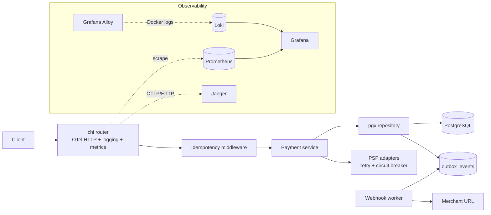

# PayFlowMock

PayFlowMock is a Go payment-orchestration demo. It exposes a small HTTP API, routes payment charges to bundled Stripe- and Razorpay-like PSP mocks, retries transient PSP errors, protects providers with circuit breakers, persists payment state in PostgreSQL, and uses Redis/PostgreSQL-backed HTTP idempotency. Payment state changes also create transactional outbox events that a worker delivers to merchant webhooks.

The project is designed for exercising payment integrations and observability patterns without calling real PSPs.

## Implemented behavior

- Supported currencies: `USD`, `EUR`, `GBP`, and `INR`.
- Default routing: `INR` → `razorpay_mock`; `USD`, `EUR`, and `GBP` → `stripe_mock`.
- Charges use three attempts with exponential backoff and full jitter for retryable failures.
- Each mock PSP has an independent circuit breaker: five consecutive failures open it, and it probes up to three requests after a 30-second timeout.
- Refunds currently validate the payment and perform the refund row insert plus `success` → `refunded` payment transition atomically in PostgreSQL. The PSP refund adapter methods are available for extension but are not invoked by the current HTTP refund service.
- Successful, failed, and refunded transitions enqueue `payment.success`, `payment.failed`, or `payment.refunded` events in the same database transaction.
- Payment IDs and outbox event IDs use UUID v7.
- The server emits structured JSON logs, Prometheus metrics, and OpenTelemetry traces.

## Architecture


```mermaid
flowchart LR
    Client --> HTTP["chi router<br/>OTel HTTP + logging + metrics"]
    HTTP --> Idem["Idempotency middleware"]
    Idem --> Svc["Payment service"]
    Svc --> Repo["pgx repository"]
    Svc --> PSP["PSP adapters<br/>retry + circuit breaker"]
    Repo --> PG[(PostgreSQL)]
    Repo --> Outbox[(outbox_events)]
    Worker["Webhook worker"] --> Outbox
    Worker --> Merchant["Merchant URL"]

    subgraph observability [Observability]
      Prom[(Prometheus)]
      Graf[Grafana]
      Jaeger[Jaeger]
      Loki[(Loki)]
      Alloy["Grafana Alloy"]
    end
    HTTP -. scrape .-> Prom
    HTTP -. OTLP/HTTP .-> Jaeger
    Alloy -. Docker logs .-> Loki
    Prom --> Graf
    Loki --> Graf
```

## Quickstart

Requirements: Docker with Compose and Go 1.25.4 or newer (`go.mod`). Go is only needed for host-side development and tests; the Compose app is built in Docker.

1. Create local configuration:

   ```bash
   cp .env.example .env
   ```

   Change the example PostgreSQL password before using the stack. Keep `POSTGRES_USER`, `POSTGRES_PASSWORD`, and `POSTGRES_DB` aligned with `DATABASE_URL`. Because the migrations use a split layout, add this container path to `.env` for `make stack-up`:

   ```dotenv
   MIGRATIONS_PATH=/app/migrations/up
   ```

   Remove or change that override before using the same `.env` with host-run `make run`; the host path is `migrations/up`.

2. Start the full stack:

   ```bash
   make stack-up
   ```

   This starts PostgreSQL, Redis, the API, Jaeger, Prometheus, Loki, Grafana Alloy, and Grafana. The server applies migrations during startup. The default API address is `http://127.0.0.1:8080`.

   The image contains the split migration layout under `/app/migrations/up`, and the migration path must point to the directory containing the numbered `*.up.sql` files.

3. Check the service:

   ```bash
   curl -sS http://127.0.0.1:8080/healthz
   ```

4. Stop the stack when finished:

   ```bash
   make stack-down
   ```

For lightweight development, `make up` starts only PostgreSQL and Redis and `make run` starts the API on the host. The server loads `.env` with `godotenv`. Host-run traces can be sent to a collector at `http://127.0.0.1:4318`; Docker services use `http://jaeger:4318`.

### Stack URLs

| Service | URL | Notes |
| --- | --- | --- |
| API | http://127.0.0.1:8080 | Main HTTP server |
| Jaeger | http://127.0.0.1:16686 | Trace search |
| Prometheus | http://127.0.0.1:9090 | Metrics and queries |
| Loki | http://127.0.0.1:3100 | Log storage API |
| Alloy | http://127.0.0.1:12345 | Alloy HTTP/server endpoint |
| Grafana | http://127.0.0.1:3000 | Default login: `admin` / `admin` |

Grafana provisions Prometheus and Loki automatically and loads the **PayFlow** dashboard from `deploy/grafana/dashboards/payflow.json`.

## Configuration

| Variable | Description |
| --- | --- |
| `DATABASE_URL` | Required PostgreSQL DSN. |
| `REDIS_ADDR` | Redis `host:port`; defaults to `127.0.0.1:6379`. Compose overrides it to `redis:6379`. |
| `POSTGRES_USER`, `POSTGRES_PASSWORD`, `POSTGRES_DB` | PostgreSQL Compose service settings. |
| `TEST_DATABASE_URL` | Separate PostgreSQL DSN used by integration tests. |
| `PORT` | HTTP listen port; defaults to `8080`. |
| `MIGRATIONS_PATH` | Directory containing migration files. When unset locally, the server prefers `./migrations/up` when present and otherwise uses `./migrations`. |
| `IDEMPOTENCY_REQUEST_TIMEOUT` | PostgreSQL idempotency lease duration; defaults to `60s`. Set it longer than the slowest mutating request. |
| `MERCHANT_WEBHOOK_URLS` | Comma-separated `merchant-uuid=https://endpoint` entries. Invalid entries are ignored. |
| `DEFAULT_WEBHOOK_URL` | Fallback webhook URL when no merchant-specific URL matches. |
| `WEBHOOK_SIGNING_SECRET` | Optional shared HMAC-SHA256 secret for webhook signatures. |
| `WEBHOOK_POLL_INTERVAL` | Outbox worker polling interval; defaults to `5s`. |
| `OTEL_EXPORTER_OTLP_ENDPOINT` | OTLP/HTTP trace endpoint; defaults to `jaeger:4318`. |
| `OTEL_SERVICE_NAME` | OTel `service.name`; defaults to `payflow`. |
| `OTEL_TRACES_SAMPLER_ARG` | Parent-based trace ID ratio in `[0,1]`; defaults to `1.0`. |
| `OTEL_SERVICE_VERSION` | Optional OTel service version; defaults to `dev`. |
| `OTEL_DEPLOYMENT_ENV` | Optional OTel deployment environment; defaults to `dev`. |
| `LOG_LEVEL` | Zerolog level (`trace` through `disabled`); defaults to `info`. |
| `GRAFANA_ADMIN_USER`, `GRAFANA_ADMIN_PASSWORD` | Optional Grafana Compose credentials; defaults to `admin` / `admin`. |

`API_KEY` is present in `.env.example` and the Postman collection, but the current server does not register an API-key authentication middleware. It is therefore not enforced by this implementation.

## HTTP API

The API is rooted at `/v1`. Errors use this shape:

```json
{"error":{"code":"VALIDATION_ERROR","message":"..."}}
```

| Method | Path | Behavior |
| --- | --- | --- |
| `POST` | `/v1/payments` | Create and charge a payment; returns `201`. PSP declines and exhausted PSP failures return a successful HTTP response with `status: "failed"`. |
| `GET` | `/v1/payments/{id}` | Return persisted payment details; returns `404` for an unknown UUID. |
| `POST` | `/v1/payments/{id}/refund` | Refund a successful payment and mark it `refunded`; returns `200`. |
| `GET` | `/healthz` | Ping PostgreSQL; returns `200` with `{"status":"ok"}` or `503` with `DB_UNAVAILABLE`. |
| `GET` | `/metrics` | Prometheus text exposition endpoint. |

### Payment request

`POST /v1/payments` requires `merchant_id`, a positive integer `amount`, a supported `currency`, and a body `idempotency_key`:

```json
{
  "merchant_id": "550e8400-e29b-41d4-a716-446655440000",
  "amount": 100,
  "currency": "USD",
  "idempotency_key": "payment-001"
}
```

Amounts are integer minor units (for example, cents or paise), must fit in a signed 64-bit integer, and must be sent as JSON numbers rather than strings. The create response is:

```json
{"payment_id":"<uuid-v7>","status":"success"}
```

Possible payment statuses are `initiated`, `processing`, `success`, `failed`, and `refunded`. `GET /v1/payments/{id}` serializes `amount` as a decimal string because the domain model uses `big.Int`.

### Refund request

`POST /v1/payments/{id}/refund` requires a positive `amount`, matching `currency`, and a body `idempotency_key`. The payment must be `success`, and the refund amount cannot exceed the original payment amount:

```json
{
  "amount": 100,
  "currency": "USD",
  "idempotency_key": "refund-001"
}
```

The response is `{"refund_id":"<uuid>","status":"success"}`. The associated payment becomes `refunded`.

### curl examples

```bash
curl -sS -X POST http://127.0.0.1:8080/v1/payments \
  -H 'Content-Type: application/json' \
  -H 'Idempotency-Key: demo-create-1' \
  -d '{
    "merchant_id": "550e8400-e29b-41d4-a716-446655440000",
    "amount": 100,
    "currency": "USD",
    "idempotency_key": "payment-001"
  }'

curl -sS http://127.0.0.1:8080/v1/payments/<payment-id>

curl -sS -X POST http://127.0.0.1:8080/v1/payments/<payment-id>/refund \
  -H 'Content-Type: application/json' \
  -H 'Idempotency-Key: demo-refund-1' \
  -d '{"amount":100,"currency":"USD","idempotency_key":"refund-001"}'
```

### HTTP idempotency

For `POST`, `PUT`, `PATCH`, or `DELETE`, send `Idempotency-Key` (or `X-Idempotency-Key`) to enable response replay. The middleware stores the complete status, headers, and body for 24 hours. Reusing a key with a different method, path, or request body returns `409 Conflict`.

Redis is the fast response cache and distributed lock. PostgreSQL stores the completed response and provides a lease fallback when Redis is unavailable. The application still requires a successful Redis ping during startup. Omitting the header bypasses the HTTP middleware, but create and refund bodies still require their own domain `idempotency_key`.

## Webhooks

Payment success/failure and refund transitions enqueue a JSON event in `outbox_events` within the same PostgreSQL transaction as the state change. The worker polls every five seconds by default, claims up to 20 events, delivers up to eight concurrently, uses a 10-second HTTP timeout, retries up to 10 attempts with jittered exponential backoff capped at 10 minutes, and marks exhausted events `DEAD`. Stale `PROCESSING` rows are reclaimed after two poll intervals.

The worker sends:

- `Content-Type: application/json`
- `X-PayFlow-Event-Id`
- `X-PayFlow-Event-Type`
- `Idempotency-Key` set to the event UUID
- `X-PayFlow-Signature: sha256=<hex>` when `WEBHOOK_SIGNING_SECRET` is configured

The payload is an envelope with `id`, `type`, `created_at`, and `data`. The data includes payment and merchant IDs, amount, currency, status, PSP metadata, and refund metadata for refund events. If no webhook URL is configured, the event is marked dead rather than retried.

For a local receiver:

```bash
make webhook-sink
```

Use `DEFAULT_WEBHOOK_URL=http://127.0.0.1:9999/webhook` for a host-run API. When the API runs in Compose, use a URL reachable from the container, such as `http://host.docker.internal:9999/webhook` on Docker Desktop, or run a receiver as another Compose service.

## Observability

The API emits zerolog JSON to stdout, exposes `/metrics`, and exports OTel traces with a batch OTLP/HTTP processor. HTTP, service, PSP, database, Redis, and webhook operations are instrumented. Logs include `request_id` and, when a valid trace is active, `trace_id` and `span_id`.

### Prometheus metrics

| Metric | Type | Labels |
| --- | --- | --- |
| `payflow_http_requests_total` | Counter | `route`, `method`, `status` |
| `payflow_http_request_duration_seconds` | Histogram | `route`, `method` |
| `payflow_payments_total` | Counter | `status` |
| `payflow_payment_latency_seconds` | Histogram | `psp` |
| `payflow_psp_attempts_total` | Counter | `psp`, `op`, `outcome` |
| `payflow_psp_retry_attempts_total` | Counter | `outcome` |
| `payflow_psp_circuit_state` | Gauge | `psp`; `0` closed, `1` half-open, `2` open |
| `payflow_webhook_delivery_attempts_total` | Counter | `outcome` (`success`, `retry`, `dead`, `error`) |
| `payflow_webhook_delivery_latency_seconds` | Histogram | none |
| `payflow_outbox_pending` | Gauge | none |
| `payflow_idempotency_cache_total` | Counter | `result` |

Go runtime and process collectors (`go_*`, `process_*`) are also registered. Example queries:

```promql
histogram_quantile(0.95, sum by (le, route) (rate(payflow_http_request_duration_seconds_bucket[5m])))

sum by (psp) (rate(payflow_psp_attempts_total{outcome="retryable_error"}[1m]))

histogram_quantile(0.95, sum(rate(payflow_webhook_delivery_latency_seconds_bucket[5m])) by (le))
```

### Traces and logs

In Jaeger, select the service configured by `OTEL_SERVICE_NAME` and look for operations such as `payment.create`, `payment.refund`, `psp.charge`, and `webhook.deliver`.

In Grafana → Explore → Loki, start with:

```logql
{service="app"}
{service="app"} |= "trace_id"
{service=~"app|postgres|redis|jaeger|prometheus|loki|alloy|grafana"}
```

Grafana Alloy collects Docker logs for the `payflowmock-*` containers and labels them with Compose `service`, Docker `container`, `compose_project`, and `job`. Host-run API logs are not collected by Alloy.

## Make targets

Run `make help` for the complete list.

| Target | Purpose |
| --- | --- |
| `stack-up` / `stack-down` | Build/start or stop the full Compose stack. |
| `up` / `down` | Start or stop only PostgreSQL and Redis. |
| `run` | Run `./cmd/server` on the host. |
| `logs` | Follow Compose logs; use `SERVICES="app grafana"` to scope them. |
| `docker-build` | Build the app image using vendored modules. |
| `vendor` | Refresh `vendor/` after dependency changes. |
| `build` / `clean` | Build `bin/server` or remove `bin/`. |
| `test` | Run the full race-enabled test suite. |
| `test-unit` | Run race-enabled short tests; skips database/Redis integration paths. |
| `test-integration` | Run repository, handler, and middleware integration tests. |
| `test-week2-unit` / `test-week2-integration` | Retry, PSP, service, and idempotency test subsets. |
| `test-week3-unit` / `test-week3-integration` | Domain/merchant and webhook worker test subsets. |
| `migrate-up` / `migrate-down` | Apply or roll back migrations using the `migrate` CLI. |
| `webhook-sink` | Start the local Python webhook receiver on port `9999` (override `WEBHOOK_SINK_PORT`). |

Integration tests use `TEST_DATABASE_URL`, load `.env` when present, and may require the local Redis service for idempotency paths. Keep the test database separate from the development database.

The Docker build uses `vendor/` to avoid dependency downloads during image builds. Run `make vendor` after changing `go.mod`. Optional build-time certificates can be placed as `*.crt` files in `deploy/docker/extra-ca/`.

## Postman collection

Import [`postman/PayFlowMock.postman_collection.json`](postman/PayFlowMock.postman_collection.json) to exercise health, metrics, USD and INR payments, retrieval, refunds, validation errors, idempotency replay, and sample webhook envelopes. The collection stores the created `payment_id` and generated `refund_id` in collection variables.

## Project layout

- `cmd/server` — startup, migrations, dependency wiring, HTTP server, OTel, and webhook worker lifecycle.
- `internal/domain` — payment, refund, status-transition, and outbox models.
- `internal/handler` — HTTP decoding, response encoding, and error mapping.
- `internal/service` — payment validation, PSP charge orchestration, retries, and refund use case.
- `internal/repository` — PostgreSQL persistence and transactional outbox writes.
- `internal/psp` — PSP contracts, Stripe/Razorpay mocks, routing, and circuit breakers.
- `internal/middleware` — request logging, metrics, and distributed idempotency.
- `internal/worker`, `internal/merchant` — webhook polling/delivery and environment-based merchant registry.
- `pkg/logger`, `pkg/metrics`, `pkg/tracer` — observability building blocks.
- `migrations/up`, `migrations/down` — PostgreSQL migration files.
- `deploy/prometheus`, `deploy/grafana`, `deploy/loki`, `deploy/alloy` — metrics, dashboards, datasources, and log shipping.
- `scripts/webhook_sink.py` — local webhook receiver.
- `Dockerfile`, `docker-compose.yml`, `Makefile` — build, stack, and development workflows.

## Known implementation boundaries

- PSP mocks use in-code default configurations with no artificial latency or failure rate; changing those scenarios currently requires code/test configuration.
- The current HTTP server has no authentication middleware, so `API_KEY` is documentation/configuration scaffolding only.
- Refund HTTP flows do not call the PSP refund adapter yet; they update the local payment/refund records and emit the refund webhook event.
